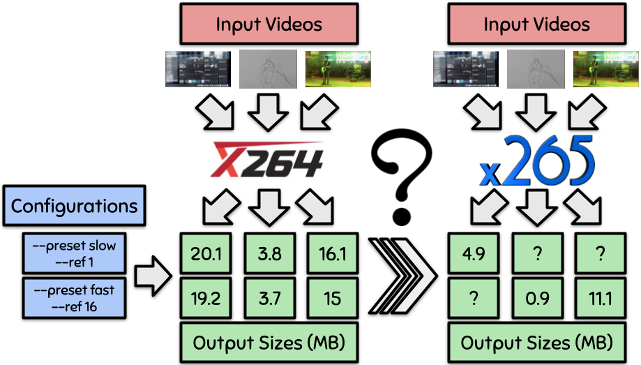

# VaMoS 2022

This repository contains the data, teh procedures and the replication bundle associated to our submission.

### Organisation

Measurements and details about the performances can be consulted in the **data** folder.

Source code can be found in the **src** directory.

The **results** folder contains the results shown in the submission, as well as complementary results.

To replicate our results, please enter the **replication** directory.

The submission pdf can be consulted in the root directory.

### Overview

This paper presents a minimal example proving that it is yet possible to transfer performance between different software systems. 
We also discuss the limitations of our work and highlight the open challenges to face when scaling to other domains or other software systems. 

